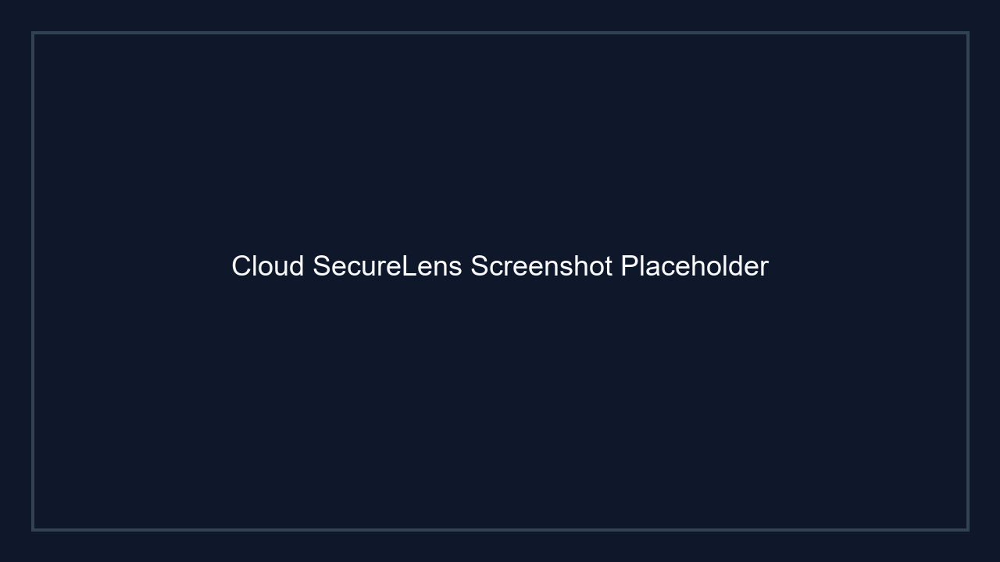

# Cloud SecureLens

Cloud SecureLens is a security audit dashboard for monitoring AWS accounts, IAM posture, database access, login activity, and recommendations in a centralized interface.

## Features

- Dashboard with security score, login activity, IAM metrics, and database exposure
- AWS account onboarding via cross-account IAM role or access keys
- IAM security auditing, login/audit trail visualization, and recommendation summaries
- Database activity and audit views for Aurora and other supported engines
- Role-based authenticated user experience with session support

## Architecture

- Next.js app using the App Router and server components
- Custom layout, sidebar, and UI component library for consistent design
- API routes for dashboard, account sync, database audit, IAM, login audit, and recommendations
- Prisma ORM with SQLite/PostgreSQL-compatible schema and migrations
- Session-based authentication using NextAuth or a local auth provider

### Architecture Diagram


## Tech Stack

- Next.js 14+ with TypeScript
- React and server components
- Prisma for database modeling and migrations
- Tailwind-like styling via custom CSS and design system components
- NextAuth-style session management and authentication providers

## AWS Services

- AWS IAM for cross-account role trust and credential management
- AWS CloudTrail for login and audit trail event collection
- Amazon RDS/Aurora for database security and activity auditing
- AWS Security Audit policies for read-only security posture checks

## Deployment

1. Install dependencies:

```bash
npm install
```

2. Run the development server:

```bash
npm run dev
```

3. Open `http://localhost:3000`

4. For production, build and start:

```bash
npm run build
npm run start
```

## Database

- Managed through Prisma schema and migrations in `prisma/`
- Initial migration and seed scripts are available in `scripts/`
- Supports local development with SQLite or a compatible production database

## Demo

- The application includes a demo dashboard experience showing security score, IAM user counts, database exposure, login trends, and recommendations.
- Use the seeded data or connect AWS accounts to see live audit data.

## Screenshots



> Replace this image with actual screenshot assets if available.
